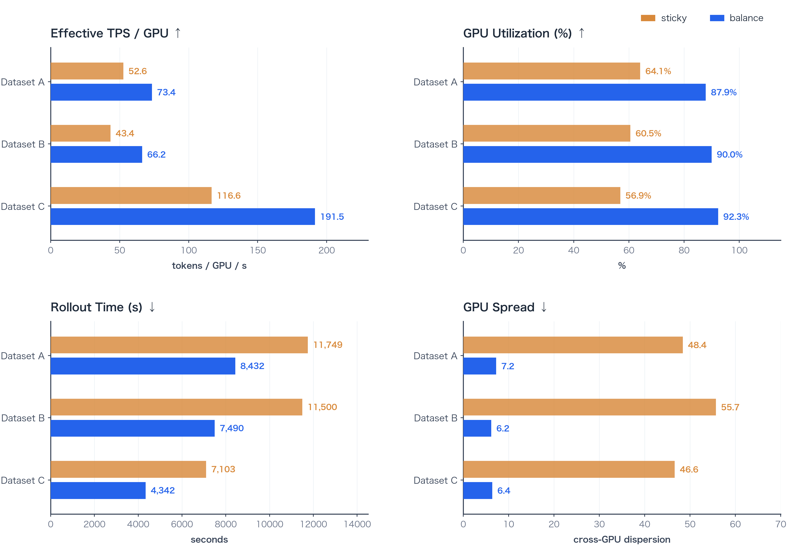
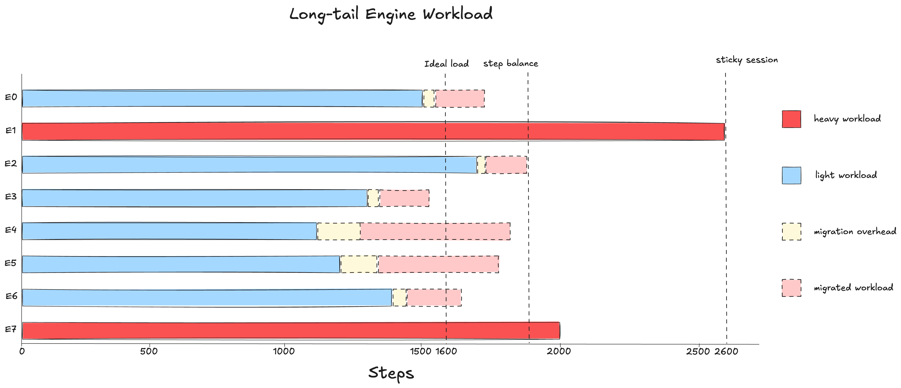
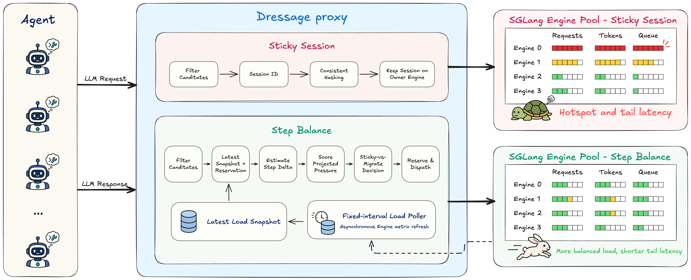
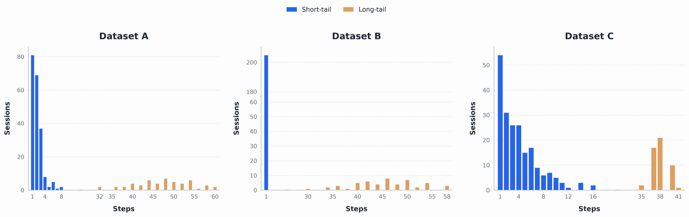
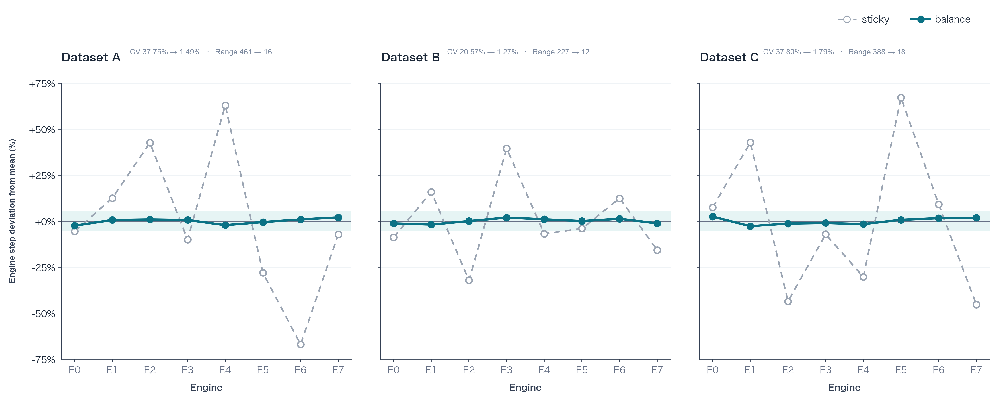
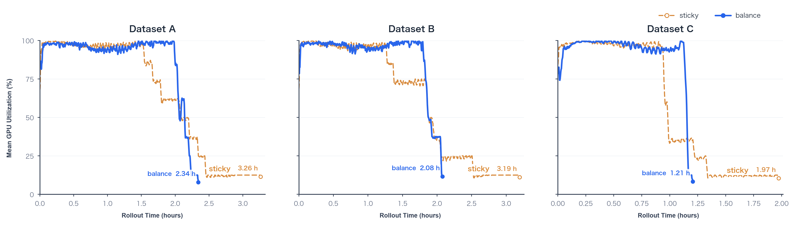
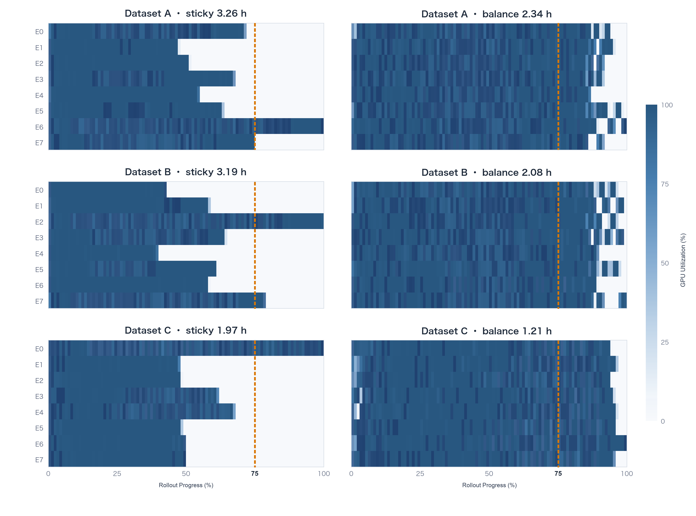

# Dressage 的 Rollout 负载均衡：From Sticky Session To Step Balance

Agentic RL rollout 的推理负载具有明显的动态性和长尾特征。Dressage 原有的 sticky session 路由将同一 session 的 generation step 稳定地发送到同一 SGLang Engine，以提高 KV cache 的前缀复用率。这一策略具有良好的 cache locality，但不会根据 rollout 过程中不断变化的实际负载重新分配 session。同步场景下，多个长尾 session 一旦集中到少数 Engine，整个 rollout batch 的完成时间就会被这些 Engine 决定，其余 GPU 则会提前进入等待。

在一个 8 Engine、128 条 trajectory 的简化估算中，如果长尾负载让最重 Engine 的等价 step 数从理想均衡下的 1,600 增长到 2,600，同步 rollout batch 的完成时间会从 16s 增加到 26s，集群吞吐从 800 step/s 降至约 492 step/s，平均 GPU 利用率也会从接近 100% 降至约 61.5%。这组数字作为容量估算示例，说明 Engine 级负载倾斜会直接转化为 rollout 时间和 GPU 利用率损失。

Dressage Proxy Step Balance 在 Proxy 侧以 generation step 为粒度进行在线调度，综合 Engine 负载快照、本地调度增量和 context recovery 条件选择目标 Engine，并通过迁移收益阈值减少不必要的切换。Proxy 始终发送完整 `input_ids`，实际 cache hit 仍由 SGLang 决定，因此不改变其原生 cache correctness 语义。

在三组具有不同长尾形态的 workload 中，Step Balance 均改善了 Effective TPS/GPU、GPU 平均利用率、rollout 时间和 GPU Spread，各 Engine step 分布的 Coefficient of Variation（CV）也从最高约 **38%** 降至 **2% 以下**。具体收益会随 workload 的负载偏斜程度变化；当原始分配已经较为均衡时，可进一步优化的空间相对有限。



*图 1：三组 multi-step workload 的核心性能指标对比。*

## 01 Motivation：为什么需要 Step 负载均衡

### Agentic RL 的推理负载

Agentic RL 中，一条 trajectory 通常不是一次独立的模型调用，而是由多个 generation step 组成的 session。模型生成 action 后，agent 可能调用工具、执行代码或与外部环境交互，再携带此前的对话和环境反馈发起下一次生成。后续 step 的输入通常包含前序 step 的完整上下文，因此同一 session 内存在很强的前缀复用机会。

与此同时，不同 session 的工作量很难在开始时准确预测：

- **交互轮数不同**：简单任务可能很快结束，复杂任务会产生更多中间 turn 和 generation step。
- **上下文长度不同**：工具返回、检索结果、代码 diff 和执行日志会持续扩大部分 session 的 prompt。
- **生成长度不同**：各 step 的 response token 数不同，对 decode 时间和资源占用的影响也不同。
- **再次到达时间不同**：工具执行和 sandbox 操作会打散同一 batch 内 session 的请求节奏。

因此，Agentic RL 同时具有两种看似矛盾的调度需求：同一 session 的连续 step 应尽量留在原 Engine 上复用 KV cache，但 Engine 之间的负载又会随着 trajectory 展开而持续变化。即使通过轮询在开始时均匀分配 session，长轨迹和多 step session 仍可能在后续产生更多计算量和等待时间，进而造成运行时失衡。

### Session Sticky 与 KV 复用

Dressage 原有方案采用 session 级粘性路由：Proxy 将 `session_id` 作为 `routing_key`，通过 `X-SMG-Routing-Key` 传给 SGLang Router；在 `consistent_hashing` 策略下，同一 session 的 generation step 通常会持续落到同一 Engine。

这一设计的核心收益是 KV cache 复用。Agentic session 的后续 step 往往只是在已有上下文后追加少量 token；继续由原 Engine 处理时，Engine 可以复用已驻留的前缀 KV，只计算新增 suffix。即使部分前缀从 GPU KV cache 换出，部署中的 HiCache L2 也可以在同一 Engine 的 Host Memory 中保留可恢复前缀，进一步强化单 Engine 内的 cache locality。如果 step 被任意切换到其他 Engine，目标 Engine 可能需要重新 prefill 完整上下文，负载均衡带来的等待时间收益很容易被 KV 重建成本抵消。

因此，sticky session 在 Agentic RL 推理中是合理的默认策略：它以很低的路由开销换取稳定的 cache locality，也避免 session 在 Engine 间无意义地往复迁移。真正的问题不在于粘性本身，而在于归属一旦确定，后续路由不会再根据 trajectory 展开后的实际工作量调整。

### 同步 Rollout 的长尾瓶颈

在同步 rollout 中，训练流程需要等待当前 batch 内的 trajectory 全部完成后才能进入下一阶段。轮询可以让 batch 开始时每个 Engine 拿到相近数量的 session，但如果长 trajectory 恰好集中到少数 Engine，这些 Engine 会逐渐成为热点。Sticky session 策略下，轻载 Engine 不能接管热点 Engine 上后续到达的 step，batch 的完成时间就会被少数热点 Engine 拉长。

下面用一个同步 rollout batch 的简化模型估算负载长尾的影响。设系统部署 8 个 SGLang Engine，初始生成 128 条 trajectory，每个 Engine 初始接收 16 条。为了便于计算，先把不同长度和不同耗时的 generation step 统一折算为等价 step，并假设单个 Engine 的处理能力为 100 step/s。

理想均衡情况下，每个 Engine 处理 1,600 个等价 step，整个 batch 共有 12,800 个等价 step：

```math
T_{\mathrm{ideal}}
= \frac{1{,}600}{100}
= 16\ \mathrm{s}
```

```math
\mathrm{Throughput}_{\mathrm{ideal}}
= \frac{12{,}800}{16}
= 800\ \mathrm{step/s}
```

Agentic rollout 的长尾会让各 Engine 的后续 step 数逐渐分化。假设同一个 batch 的总 step 数仍为 12,800，但分布变为下图所示：



*图 2：8 个 Engine、128 条 trajectory、12,800 个等价 step 的简化长尾负载估算。1,600 step 表示理想均衡负载；Engine 1 上的 2,600 step 表示尾部热点。*

由于同步 batch 需要等待最晚完成的 Engine，尾部热点会把 wall time 拉长到：

```math
T_{\mathrm{tail}}
= \frac{2{,}600}{100}
= 26\ \mathrm{s}
```

集群有效吞吐降为：

```math
\mathrm{Throughput}_{\mathrm{tail}}
= \frac{12{,}800}{26}
\approx 492\ \mathrm{step/s}
```

相比理想均衡状态，吞吐下降约：

```math
1 - \frac{492}{800}
\approx 38.5\%
```

平均 GPU 利用率可以近似估算为：

```math
\mathrm{Utilization}_{\mathrm{tail}}
= \frac{12{,}800 / 100}{8 \times 26}
= \frac{128}{208}
\approx 61.5\%
```

这个例子说明，即使 batch 的总工作量不变，只要长尾负载集中到少数热点 Engine，同步 rollout 就会被尾部完成时间拖慢，其他 GPU 也会更早进入等待，整体利用率随之下降。但是如果像是图中一样把重载 Engine 的请求迁到轻载 Engine，尽管可能会有额外的迁移开销，仍然能有效缩短 batch 的尾部完成时间、提高整体利用率。

## 02 问题分析：Session Sticky 为什么难以应对运行时长尾

### 固定 Session 归属难以适应运行时负载变化

上面所描述的长尾现象，本质上来自固定归属和动态负载之间的矛盾。Sticky session 在 session 创建或首次请求时决定 Engine 归属，但 Agentic rollout 的负载是在后续多个 generation step 中逐步显现的：路由器看到的是一个稳定的 `session_id`，真正进入 Engine 队列的却是一批批到达时间、上下文长度和输出长度都不同的 step。因此，初始分配均衡并不等于运行时负载均衡。

这个矛盾说明，问题不是 sticky session 完全错误，而是它缺少运行时修正机制。Proxy 刚好位于每次 generation 调用的入口，因此更合理的方式是把调度粒度下沉到 step：每个 generation step 到达时，结合当时各 Engine 的实际负载重新判断该请求应该分配到哪一个 Engine，而不是沿用 session 的初始归属。这类在线决策有两个前提：负载观测必须由后台异步刷新，不能阻塞请求主路径；同时要处理观测与派发之间的延迟，避免多个并发 step 依据同一份过期观测涌向同一个低压 Engine。

### 跨 Engine Step 迁移受 KV 恢复成本约束

把调度粒度下沉到 step 后，最主要的代价不是路由表更新，而是 KV cache 的跨 Engine 恢复。已有 session 的历史前缀通常已经在 owner Engine 上形成 KV；如果后续 step 被迁移到另一台 Engine，目标 Engine 必须能够复用这段前缀，否则就需要对完整上下文重新 prefill。

这会直接改变迁移是否值得。对短上下文或轻负载 step 来说，重新 prefill 的成本可能很小；但在长上下文、多轮 agentic session 中，完整 prefill 可能比排队等待更贵。此时，单纯选择“当前看起来最空的 Engine”并不一定会缩短端到端时间，甚至可能把排队问题转化为重复计算问题。

因此，Step 级调度不能只做负载均衡，还必须把上下文恢复能力纳入候选条件：只有当目标 Engine 与当前 session 的 cache fingerprint 兼容，并且 HiCache L3、Mooncake 等恢复链路能够提供跨 Engine KV 复用时，低负载 Engine 才真正具备接管当前 step 的收益。反过来，迁移也必须设置收益门控：只有当负载收益足以覆盖 KV 恢复和额外 prefill 成本时才值得执行，避免轻微压力波动导致 session 在 Engine 间往复迁移。

由此得到的解决思路是：在 Proxy 侧引入 Step 级在线 rebalancing，以 Engine 当前压力作为请求分配信号，以 KV 恢复能力和正确性边界作为硬约束。这样既避免 session 级调度把长尾负载永久固定在少数 Engine 上，也避免为了均衡而引入过高的上下文重建成本。

## 03 Dressage 的 Step Balance

Dressage 在 sticky session 的基础上引入 Step Balance：一种 Step 级在线分配机制。每个 generation step 到达时，Proxy 不再只依赖 session 初始归属，而是结合 Engine 负载快照、本地 reservation 和上下文恢复条件，选择当前更适合承接该请求的 Engine。

### 开启与配置

Step Balance 默认关闭。在启动 Dressage Proxy 时添加 `--enable-engine-rebalancing` 即可开启；另外两个参数分别用于控制已有 session 的迁移门槛和 Engine 负载快照的轮询周期。

| CLI 参数                                                |    默认值 | 作用                                       |
| ----------------------------------------------------- | -----: | ---------------------------------------- |
| `--enable-engine-rebalancing`                         |     关闭 | 开启新 session 放置、已有 session 按 step 迁移及故障切换 |
| `--engine-rebalancing-min-load-improvement-ratio`     | `0.10` | 已有 session 自愿迁移至少需要 10% 的 Pressure 改善    |
| `--engine-rebalancing-load-snapshot-poll-interval-ms` |   `60` | 每个 Engine 的 `/v1/loads` 轮询周期             |

### 整体思路：从 Session 到 Step

Step Balance 位于 Dressage Proxy 内部。上游 Agent 向 Proxy 发起 OpenAI-compatible chat completion 请求；Proxy 在转发到 SGLang Engine 前完成路由决策。

与 sticky session 的关键差异在于调度粒度。Sticky session 在 session 创建时一次性确定归属，后续不再调整；Step Balance 以 generation step 为调度单位，每个 step 到达时，Proxy 根据最近一次可用 load snapshot 和本地 reservation 做一次在线决策，且该决策只影响当前 step 的目标 Engine。粘性并未被抛弃：sticky owner 仍然提供基础归属和本地 KV 复用路径，已有 session 默认留在 owner，只有当负载收益足够且恢复条件满足时才执行跨 Engine 分配。

<div align="center">
  
</div>

*图 3：Step Balance 架构。*

架构中有三类核心状态：

- **Engine 负载快照。** 后台 control loop 周期性读取各 Engine 的 running requests、active tokens、queue、健康状态和版本信息。请求路径不逐个探测 Engine，只读取最近一次可用快照。
- **本地 reservation。** Proxy 在请求派发前记录本次调度带来的本地增量，用来弥补快照刷新和真实 Engine 状态之间的可见性窗口。
- **Session 与恢复状态。** Proxy 记录 session 的当前 owner、历史 tokens 和 cache fingerprint，并结合 HiCache L3、Mooncake 恢复链路判断跨 Engine 迁移是否具备上下文恢复条件。

一个 step 从到达到完成经历四步：

1. **后台刷新快照。** control loop 按固定间隔轮询各 Engine 的 load snapshot（running requests、active tokens、queue、健康与版本信息）；请求主路径不做同步探测，只读取最近一次成功发布的快照。
2. **构造候选并估计压力。** step 到达时，调度器先按健康、版本兼容、快照新鲜度和上下文恢复条件过滤候选 Engine，再把快照负载与本地尚未被快照覆盖的 reservation 增量合并为 effective load，并叠加当前 step 的增量得到 projected pressure。
3. **选择目标并写入 reservation。** 调度器选出 projected pressure 最低的候选：新 session 或强制 failover 直接选中它；已有 session 只有当相对收益超过阈值时才离开当前 owner。目标确定后，Proxy 在转发请求前先写入本地 reservation，使后续并发 step 立即看到这次决策带来的预期负载，避免多个并发 step 涌向同一个旧快照下的低压 Engine。
4. **完成并释放 reservation。** 请求完成或失败后，Proxy 释放对应 reservation，避免本地估计长期高于 Engine 实际负载；请求成功时，本次目标被提交为 session 的新 owner，后续 step 以该 owner 为基准继续判断。

### 调度模型

实现中的 Engine 选择不是对全部 worker 做一次无约束 `argmin`。模型需要先确定哪些 Engine 可以承接当前 step，再用同一套压力指标比较候选 Engine。这里的关键不是追求精确预测单个请求的完成时间，而是用足够稳定、可在线获取的信号描述 Engine 的当前负载和近未来负载趋势。

这些信号来自三条路径。Engine 侧的 running requests、queued requests、active tokens、token capacity、request capacity 和 `token_usage` 由后台轮询 SGLang `/v1/loads` 获得；请求侧的 `session_id`、完整 `input_ids`、prompt 长度和当前 step 边界由 Proxy 在 OpenAI-compatible 请求入口解析；尚未被下一次快照覆盖的 queue/token 增量则来自 Proxy 本地 reservation。Session owner、历史 committed tokens、cache fingerprint 和 context recovery 状态由 Proxy 的 session 与 rebalancing 状态维护。

#### 候选 Engine 集合

候选集合首先解决“哪些 Engine 有资格接这个 step”的问题。调度器会从当前发现的 Engine 中逐个过滤：

- Engine 必须健康，且最近的 load snapshot 没有超过 stale 阈值。
- Engine 的 weight version 必须和当前请求期望版本一致。
- Engine 必须报告有效的 request capacity 和 token capacity。
- 对已有 session，目标 Engine 的 cache fingerprint 必须和当前 session 兼容，避免把请求发到无法解释同一 KV layout 的 Engine。
- 对健康 owner 之外的自愿迁移，目标 Engine 还必须满足 context recovery ready。

新 session 没有历史 cache fingerprint 约束，可以直接在健康且版本兼容的 Engine 中选择。强制 failover 会先移除不健康或版本不兼容的 owner，必要时接受完整 prefill，而不是等待原 owner 恢复。

这里的 context recovery ready 具体包含三件事：源和目标具有兼容部署，Mooncake 恢复链路已完成校准，且目标模型的 cache profile 可用。强制 failover 不受该条件限制，必要时通过完整 prefill 恢复执行。

#### 有效负载与未来增量

调度器不能只看 snapshot 中已经被 Engine 观测到的负载。由于 snapshot 是异步刷新的，Proxy 刚刚派发的请求可能还没有反映在下一次 `/v1/loads` 结果里。如果忽略这部分增量，多个并发 step 会同时看到同一个低压 Engine，并做出相同选择。

因此，Proxy 会把快照负载和本地尚未被快照覆盖的 scoring delta 合并为 effective load。对候选 Engine $e$，记 $R_{\mathrm{run}}$ 为有效 running requests， $N_{\mathrm{token}}$ 为有效 token 占用， $Q_{\mathrm{wait}}$ 为有效排队请求数，则：

```math
\begin{aligned}
R_{\mathrm{run}}(e)
&= R_{\mathrm{snapshot}}(e),\\
N_{\mathrm{token}}(e)
&= N_{\mathrm{snapshot}}(e)
 + \Delta N_{\mathrm{local}}(e),\\
Q_{\mathrm{wait}}(e)
&= Q_{\mathrm{snapshot}}(e)
 + \Delta Q_{\mathrm{local}}(e).
\end{aligned}
```

其中 $R_{\mathrm{snapshot}}$、 $N_{\mathrm{snapshot}}$、 $Q_{\mathrm{snapshot}}$ 分别对应快照中的 `running`、`active_tokens` 和 `queued`， $\Delta N_{\mathrm{local}}$、 $\Delta Q_{\mathrm{local}}$ 来自 Proxy 本地 reservation。

一次 snapshot poll 在发起请求前记录当前 reservation revision。只有当该 poll 成功发布新快照时，poll 发起前已经存在的本地 delta 才会被 acknowledge 并停止参与 scoring；poll 期间新建的 reservation 以及失败 poll 前的 delta 仍然保留。因此，每条 delta 在新 snapshot 发布前参与打分，发布后退出打分，避免漏计或与 snapshot 重复累加。

#### Per-Step 增量

仅有当前快照还不够，调度还要把“如果当前 step 分配给这个 Engine，会额外制造多少压力”加入比较。记当前 step 的完整输入长度为 $N_{\mathrm{prompt}}$，它与 session 上一次 committed tokens 的最长公共前缀长度为 $N_{\mathrm{lcp}}$。每个候选 Engine 都会先增加一个 queue item：

```math
\Delta Q_{\mathrm{step}}=1.
```

Scoring token 增量按 step 与 owner 的关系分三种情况：

```math
\Delta N_{\mathrm{step}}=
\begin{cases}
\max(0,N_{\mathrm{prompt}}-N_{\mathrm{lcp}}),
& \text{留在当前 owner},\\
N_{\mathrm{prompt}},
& \text{自愿迁移到其他 Engine},\\
N_{\mathrm{prompt}},
& \text{新 session 或强制 failover}.
\end{cases}
```

**为什么自愿迁移按完整 prompt 计分。** 留在 owner 时，历史前缀大概率已在本地 KV 中，容量压力只新增 suffix 部分；而迁移到另一台 Engine 时，目标侧能通过 Mooncake L3 恢复多少前缀，取决于恢复发生时的实际缓存状态——前缀是否仍在 L3、是否已被 evict、目标 Engine 当时还剩多少 available 空间——这些都无法在请求入口精确判定。如果 scoring 提前扣除“假定可恢复”的前缀，一旦实际命中低于预期，Proxy 就会系统性高估目标 Engine 的可用空间，把过多 step 引向看似低压的 Engine，造成过激迁移。因此 scoring 一律按最坏情况（完整 prompt 的容量压力）比较候选，即调度分数描述的是目标 Engine 接管当前 step 后的容量压力上界，而不是实际 prefill token 数。这个上界也不会长期失真：Engine 自报的 `token_usage` 会把真实缓存占用折算进 pressure，目标 Engine 上已恢复或共享的 KV 所形成的真实占用仍会体现出来，不会让目标显得比实际更空。

实际执行和观测仍然需要记录 prefill 估计，因此 lifecycle reservation 会单独维护 page-aligned LCP。记 $N_{\mathrm{lcp,page}}$ 为按目标 Engine KV page size 向下对齐后的 LCP， $N_{\mathrm{prefill}}$ 为执行侧预估的 prefill token 数，则：

```math
N_{\mathrm{prefill}}=
\begin{cases}
\max(0,N_{\mathrm{prompt}}-N_{\mathrm{lcp}}),
& \text{留在当前 owner},\\
N_{\mathrm{prompt}}-N_{\mathrm{lcp,page}},
& \text{Mooncake-ready 自愿迁移},\\
N_{\mathrm{prompt}},
& \text{新 session、强制 failover 或无法恢复}.
\end{cases}
```

用于调度打分的增量与请求生命周期内的 reservation 分开记录。前者只包含 $\Delta Q_{\mathrm{step}}$ 和 $\Delta N_{\mathrm{step}}$，用于比较候选 Engine；后者记录请求数、 $N_{\mathrm{prompt}}+N_{\mathrm{out}}$ 个预留 token 以及 $N_{\mathrm{prefill}}$，用于请求执行期间的资源占用统计。

#### Projected Pressure

Projected pressure 由 request、token 和 queue 三类压力组成，分别覆盖 Engine 正在执行的并发占用、KV/token 空间压力和已形成的排队长尾。对每个候选 Engine $e$，调度器将三项压力归一化后相加，得到目标 Engine 接收当前 step 后的投影分数。记 $C_{\mathrm{req}}$ 为 request capacity， $C_{\mathrm{token}}$ 为 token capacity， $U_{\mathrm{token}}$ 为 Engine 报告的 `token_usage`：

```math
\begin{aligned}
P_{\mathrm{run}}(e)
&=
\frac{R_{\mathrm{run}}(e)}
{C_{\mathrm{req}}(e)},\\
P_{\mathrm{token}}(e)
&=
\max\left(
\frac{N_{\mathrm{token}}(e)+\Delta N_{\mathrm{step}}(e)}
{C_{\mathrm{token}}(e)},
U_{\mathrm{token}}(e)
\right),\\
P_{\mathrm{queue}}(e)
&=
\frac{Q_{\mathrm{wait}}(e)+\Delta Q_{\mathrm{step}}}
{C_{\mathrm{req}}(e)},\\
P_{\mathrm{total}}(e)
&=
P_{\mathrm{run}}(e)
+P_{\mathrm{token}}(e)
+P_{\mathrm{queue}}(e).
\end{aligned}
```

这里的 `request_capacity` 和 `token_capacity` 都来自 Engine 快照。容量归一化使不同 TP/DP 拓扑或 cache 规模的 Engine 可以在同一尺度上比较；`max(..., token_usage)` 则保证 Proxy 的 token 估计不会低于 Engine 自己报告的实际使用率。`token_usage` 比单纯的 prompt token 估计更贴近真实缓存压力，因为它描述的是扣除 available 空间和已 evict/可回收缓存之后，Engine 仍然需要为当前 KV 状态承担的有效 token 占用。

#### Engine Selection

调度器先在候选集合 $\mathcal{C}$ 中找到 projected pressure 最低的 Engine：

```math
e_{\mathrm{best}}
=
\arg\min_{e\in\mathcal{C}}
P_{\mathrm{total}}(e).
```

代码将差值不超过 $\tau$（ $10^{-7}$，对应代码中的 `SCORE_TOLERANCE`）的候选视为同分。如果 sticky owner 位于同分集合中，调度器优先保留 owner；否则使用 `SHA256(session_id, engine_url)` 生成稳定排名，使决策在多次运行中可复现，同时将不同 session 稳定地分散到同分 Engine。

对已有且 owner 健康的 session，调度器还会计算相对负载改善，避免在收益很小时反复改变分配：

```math
G_{\mathrm{load}}
=
\frac{
P_{\mathrm{total}}(e_{\mathrm{owner}})
-P_{\mathrm{total}}(e_{\mathrm{best}})
}
{\max(P_{\mathrm{total}}(e_{\mathrm{owner}}),\varepsilon)}.
```

其中 $\varepsilon=10^{-9}$，为防止除零的小量。最终选择规则为：

```math
e_{\mathrm{target}}=
\begin{cases}
e_{\mathrm{best}},
& \text{new session 或 mandatory failover},\\
e_{\mathrm{best}},
& \text{已有 session 且 }
e_{\mathrm{best}}\neq e_{\mathrm{owner}}
\text{ 且 }
G_{\mathrm{load}}\geq\theta_{\mathrm{min}},\\
e_{\mathrm{owner}},
& \text{otherwise}.
\end{cases}
```

$\theta_{\mathrm{min}}$ 对应实现中的 `min_load_improvement_ratio`，默认值为 `0.10`。该阈值用于迁移门控：小幅负载波动不会触发迁移，只有足够大的预期改善才会替换当前 owner。新 session 和强制 failover 没有 owner 收益阈值，直接选择最低压力候选。如果 owner 健康但快照不可用，系统保留 owner；如果 failover 或新 session 暂时没有 fresh snapshot，则使用同一稳定哈希排名选择健康 Engine，而不是在不完整观测上做激进迁移。

## 04 实验评估

我们在相同运行配置下对比 sticky session 与 Step Balance，并从 rollout 完成时间、单位 GPU 有效吞吐以及跨 Engine 负载离散程度等多个方面评估调度效果。

### 实验设置与统计口径

实验在单机 8 GPU 环境中进行，使用 Qwen3.5-4B 作为 rollout 模型，并部署 8 个单卡 SGLang Engine。实验采用同步 rollout，batch size 设置为 256，每个 prompt 采样一条轨迹，采样温度设置为 0。所有实验均使用相同的模型、数据、随机种子和推理配置，以保证结果具有可比性。

| 配置项 | 设置 |
|---|---:|
| 模型 | Qwen3.5-4B |
| Rollout Engine | 8（1 GPU / Engine） |
| Batch size | 256 |
| Context length | 256K tokens |
| Response length | 4K tokens |
| Sampling | temperature=0 |
| HiCache | ratio=2.0，`write_through`，`page_first_direct` |
| L3 cache | Mooncake（segment size=64 GB） |

Baseline 使用 sticky session，实验组在相同实验配置下启用 Step Balance。负载快照轮询间隔设置为 60 ms；最小迁移收益阈值根据 workload 分布分别设置。

### Workload 配置

我们将 workload 分布视为影响调度性能的重要实验因素。对于 sticky session，不同的轨迹长度组成会形成不同程度和不同形态的 Engine 间负载偏斜。基于内部压测中反复观察到的负载形态，我们抽象出三组 workload，以覆盖不同的轨迹长度组成和负载偏斜模式，包括“短尾与宽长尾并存”“大量单步轨迹与宽长尾并存”以及“宽短尾与集中长尾并存”三类情况，对应图中的 A、B、C 三种数据分布。



*图 4：三组 multi-step workload 的 step 分布。横轴表示单条 session 的 generation step 数，纵轴表示对应 session 数。*

实验中，Dataset A 和 Dataset B 的最小迁移收益阈值设置为 0.0，Dataset C 设置为 0.1。

在这些 workload 下，我们进一步观察 Step Balance 对 sticky session 所产生运行时负载偏斜的动态响应。当负载快照与本地 reservation 均表明某个 Engine 持续偏热，且迁移满足 KV 恢复条件和最小收益阈值时，后续 step 会被重新分配至负载较低的候选 Engine，从而缩短局部热点持续存在的时间；而当当前分配已经较为均衡时，调度器保持原有 owner，不触发额外迁移，从而避免不必要的 KV 恢复开销。

### 性能与负载均衡

在三组 workload 中，Step Balance 均呈现正向收益，Effective TPS/GPU 的观测提升范围为 39.4%～64.2%。其中较高增益对应长尾和负载偏斜更明显的数据分布，不应直接外推为普遍收益；当原始分配已经较为均衡时，可进一步优化的空间相对有限。与此同时，GPU 平均利用率提高，rollout 时间和 GPU Spread 降低，各 Engine step 分布的 CV 从最高约 **38%** 降至 **2% 以下**。


*图 5：三组 multi-step workload 的核心性能指标对比。*



*图 6：各 Engine 实际处理 step 数相对均值的偏差。*

从 step 分布可以看出，sticky 模式下的后续请求并没有均匀分布在 8 个 Engine 上，部分 Engine 的 step 数明显高于平均值，另一些则较早空闲。启用 Step Balance 后，各 Engine 的 step 数基本回到均值附近，GPU 之间的负载差距随之缩小。空闲算力得到利用后，集群能够在单位时间内处理更多有效 token，因此 Effective TPS/GPU 提高，rollout 也更早结束。

### Rollout 尾部利用率

性能差异主要出现在 rollout 尾部，而不是前半程。两种模式在开始阶段都能让 8 张 GPU 接近满载；随着短轨迹陆续结束，sticky 的剩余工作逐渐集中到少数 Engine，而 Step Balance 可以继续利用已经空闲的 Engine 处理长轨迹的后续 step。



*图 7：Rollout 期间集群 GPU 平均利用率随时间的变化曲线。*



*图 8：各 Engine GPU 利用率随归一化 rollout 进度的变化热力图。75% 竖线标记 rollout 尾部区间的起点。*

时间序列进一步说明，差异主要出现在 rollout 后半段。sticky 下，一些 Engine 提前完成任务后进入空闲状态，GPU 平均利用率随之逐级下降；在最后 25% 的区间内，热力图中已经出现大面积空白，只剩少数 Engine 继续工作。Step Balance 会把后续 step 分配给这些空闲 Engine，因此高利用率能够维持得更久，各 Engine 的完成时间也更接近。以 Dataset B 为例，整体完成时间从 **3.19 小时**降至 **2.08 小时**。这组结果说明，Step Balance 缩短 rollout 的关键不是让前半程跑得更快，而是减少尾部等待。

## 05 后续演进

### 当前范围：Single-Step Greedy

Step Balance 当前以单个 generation step 为调度单位。Step 到达 Proxy 后，调度器基于最新 Engine snapshot 和本地增量立即做出贪心选择。这是当前默认路径，也将作为后续批调度的 fallback。

### Single-Step Greedy → Multi-Step MILP

**从 1 对 N 到 M 对 N。** 当前的逐 step Greedy 适合低延迟在线决策，但它本质上是 1 个请求对 N 个 Engine 的在线分配：每个 step 独立做 `argmin`，前一个 step 的决策会改变后续 step 看到的负载，整组请求的最终分布受到达顺序影响，只保证单步局部最优，也不会显式比较不同迁移组合的整体收益和 KV 恢复代价。后续计划引入 step-batch 调度，把问题扩展为 M 个请求对 N 个 Engine 的联合分配：Proxy 将短时间内到达的 ready steps 组成小 batch，共享同一份负载快照，用混合整数线性规划（Mixed-Integer Linear Programming, MILP）直接建模，目标函数最小化 batch 提交后的最大 Engine pressure。由于贪心产生的任何分配都是 MILP 的可行解，其最优值 $z^*$ 不会差于逐 step 贪心，而是在给定快照与增量估计下做到模型内的全局最优；当然，这个最优受快照新鲜度和增量估计保真度限制，并不等同于真实系统的全局最优。

设 $\mathcal{B}$ 为当前 batch 的 step 集合， $\mathcal C_s$ 为 step $s$ 的候选 Engine 集合， $x_{s,i}\in\{0,1\}$ 表示是否将 step $s$ 分配给 Engine $i$。 $L_i^{\mathrm{base}}$ 是 Engine 当前的基础压力， $\Delta L_{s,i}$ 是该 Engine 接收 step 后新增的负载压力。引入辅助变量 $z$ 表示 batch 提交后的最大 Engine pressure，主问题可写为：

```math
\begin{aligned}
\min_{x,z}\quad & z\\
\text{s.t.}\quad
& \sum_{i\in\mathcal{C}_s}x_{s,i}=1,
&& \forall s\in\mathcal{B},\\
& L_i^{\mathrm{base}}
+\sum_{\substack{s\in\mathcal{B}\\i\in\mathcal{C}_s}}
x_{s,i}\Delta L_{s,i}
\leq z,
&& \forall i,\\
& x_{s,i}\in\{0,1\},
&& \forall s\in\mathcal{B},\ i\in\mathcal{C}_s.
\end{aligned}
```

在此基础上，可以用 $C_{s,i}^{\mathrm{migration}}$ 表示把 step 迁移到 Engine $i$ 需要恢复或重算的 KV token 数（目标能从共享 L3 恢复前缀时，成本主要来自 restore 和剩余 prefill；否则接近完整 prefill）。在最大 pressure 达到最优值 $z^*$ 后，保留唯一分配与二元约束，继续求解：

```math
\begin{aligned}
\min_x\quad
& \sum_{s\in\mathcal{B}}\sum_{i\in\mathcal{C}_s}
x_{s,i}C_{s,i}^{\mathrm{migration}}\\
\text{s.t.}\quad
& L_i^{\mathrm{base}}
+\sum_{\substack{s\in\mathcal{B}\\i\in\mathcal{C}_s}}
x_{s,i}\Delta L_{s,i}
\leq z^*,
&& \forall i.
\end{aligned}
```

这个两阶段目标先压低 batch 提交后的最大 Engine pressure，再从达到同等负载目标的可行解中选择 KV 恢复代价更低的分配。

### Engine-Level Pressure → Path-Level Pressure

在 PD 分离场景中，一次请求的实际压力由 Prefill Engine、Mooncake KV 传输链路和 Decode Engine 三部分共同决定。当前调度仍以单个 Engine 的局部 pressure 为依据，无法统一反映 P、KV 传输和 D 三个阶段的端到端瓶颈。后续可以将现有的 Engine-level pressure 扩展为 Path-level pressure：Prefill pressure 由 Prefill 侧的 request、token 和 queue 指标计算，Decode pressure 由 Decode 侧的对应指标计算，Mooncake transfer pressure 则使用 `kv_transfer_latency_ms` 表示；将三部分压力归一化并组合为一条 P→D 执行路径的统一 pressure，再据此选择压力更低的 Prefill Engine 与 Decode Engine 组合，避免只优化 P 或 D 单侧负载而将瓶颈转移到另一阶段或 KV 传输链路。

## 06 结论

Dressage Proxy Step Balance 针对 agentic rollout 的动态长尾负载，在 Proxy 侧引入在线 Step 级调度。该方案通过后台负载快照避免请求路径同步探测，通过 revision-aware unobserved delta 修正 snapshot 延迟，并以 context recovery 可行性和迁移收益阈值约束贪心选择。

从系统角度看，该工作把负载均衡放到更合适的层次处理。Proxy 能同时看到 session 边界、token 上下文、Engine 负载和 rollout 请求流，因此可以做出比静态请求分配更贴近 agentic workload 的路由决策。它的收益边界主要取决于 workload 的长尾程度、Engine 拓扑、snapshot 新鲜度和 pressure score 对真实服务压力的刻画能力。因此，当已有分配本身较为均衡时，额外性能收益会相对有限；当运行过程中逐渐形成热点时，Step Balance 可以利用后续 step 持续纠偏。在快照有效且候选 Engine 满足迁移条件的范围内，该机制会优先把新到达的 step 引导至压力较低的 Engine，尽可能避免形成明显、持续的分配不均。
